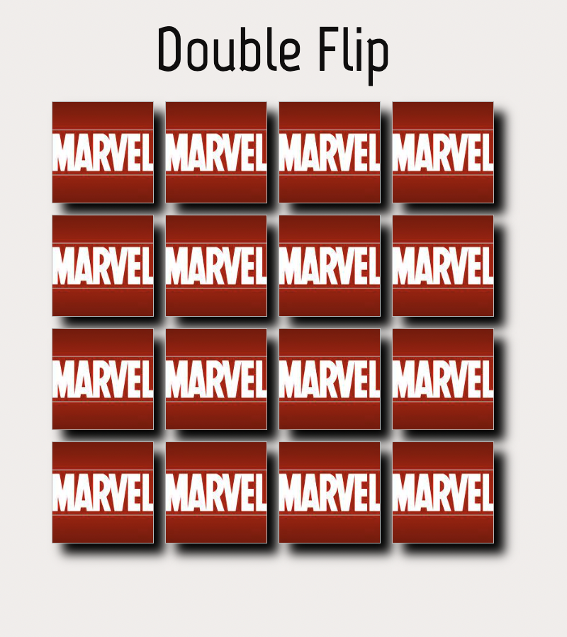
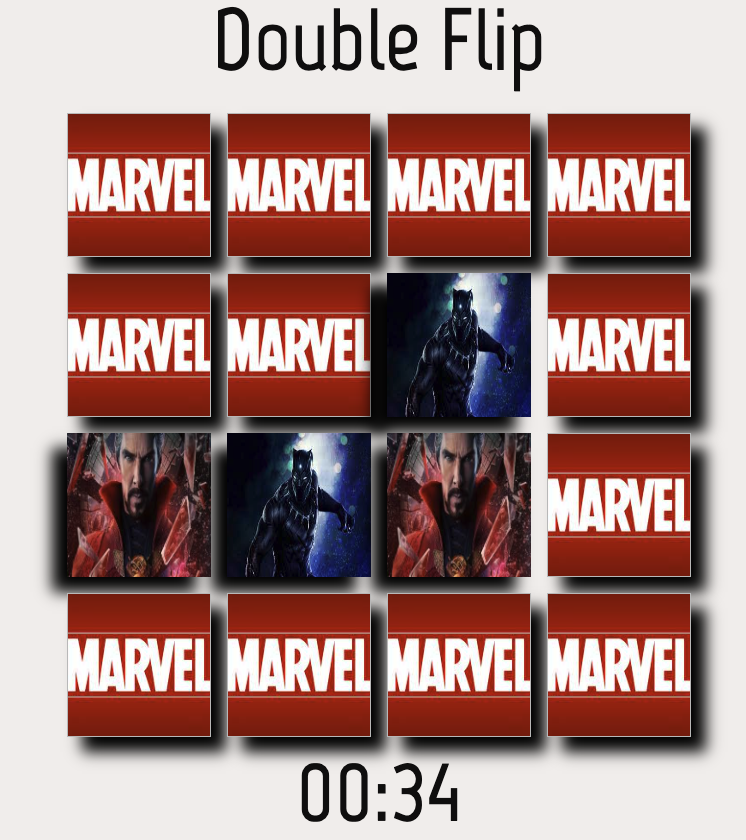

# PROJECT 1! **Browser-based Game**

# Game Title: Double Flip 
Is a memory match game to test you mental capabilities. A player will select 2 cards. If they match, Great! The cards will stay faceup and you can continue untill all are faceup. If they do not match, well then you will have to try again. 

# Screen Shots:

# Technologies used: 
HTMl- Did not use as much, but as a basic layout for my page

CSS- All the sizing, coloring etc.. is all part of the styling

JavaScript- Is used for the functionality of the game. From every card to card flip.

# Getting Started: 

# Next Steps:
Would like to have a nice start game/End Game overlay with a restart button.
Maybe more animations with the cards and background.

# Acknowledgements:

https://css-tricks.com/

https://developer.mozilla.org/en-US/

